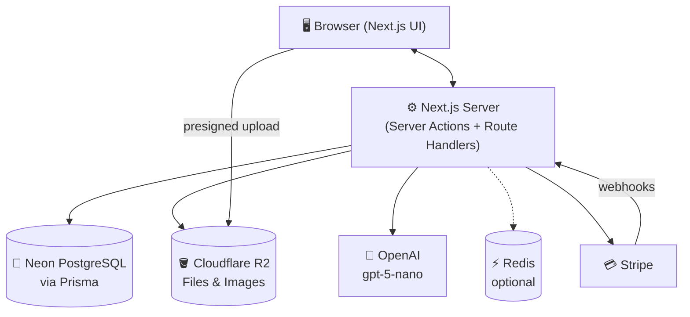
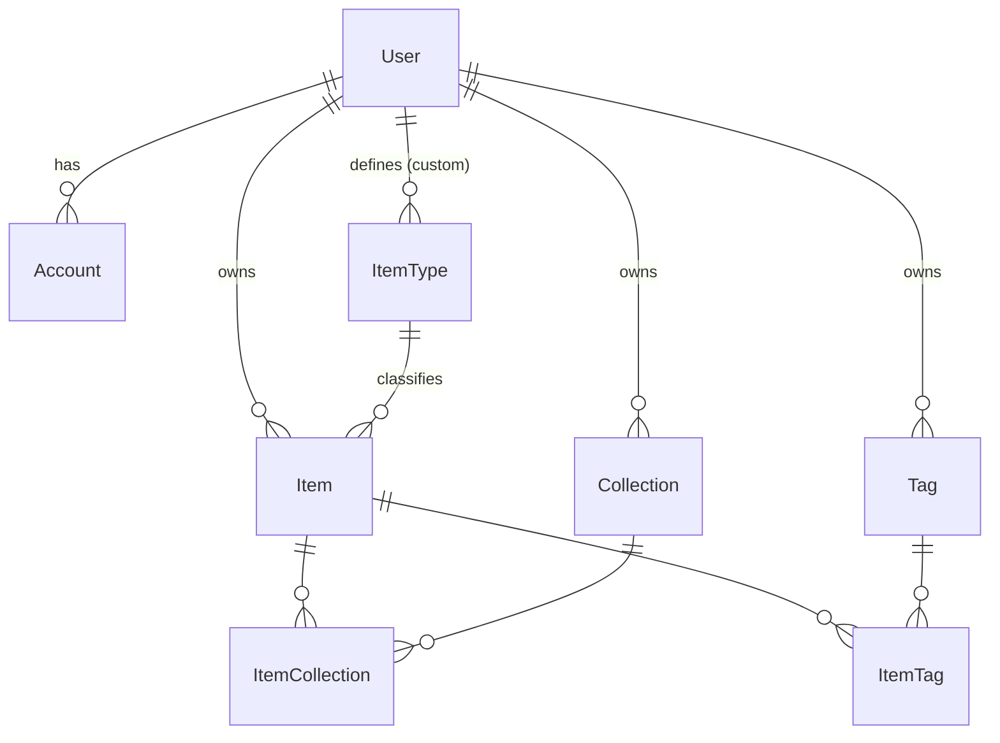
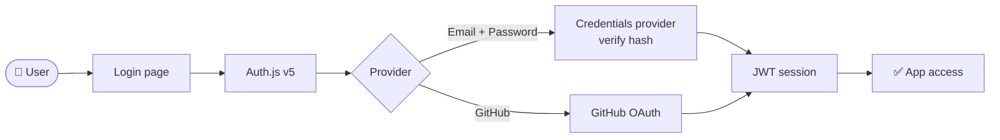
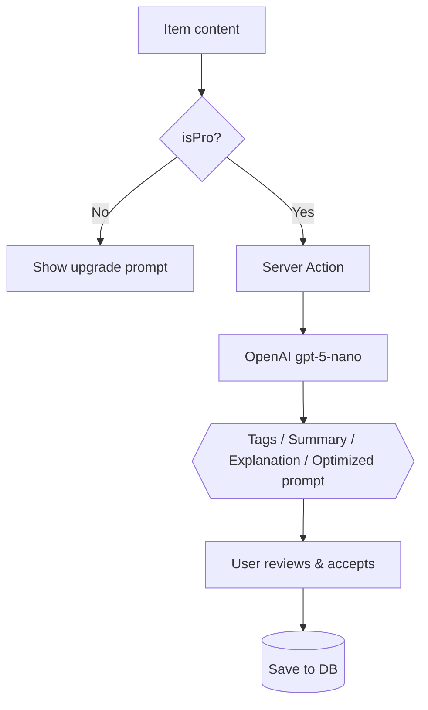
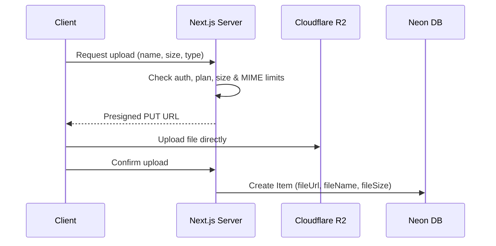
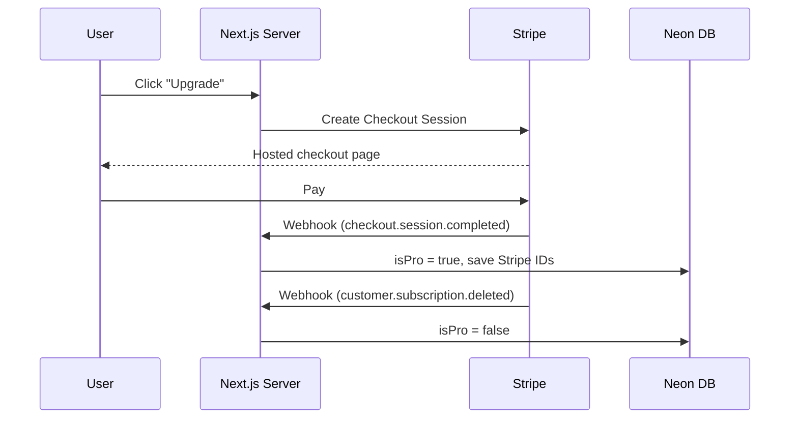

# 🗃️ DevStash — Project Overview

> **Store Smarter. Build Faster.**
> A centralized, searchable, AI-enhanced hub for developer knowledge: code snippets, AI prompts, notes, commands, files, images and links.

**Status:** 🟡 Planning → ready for environment setup & UI scaffolding

---

## 📑 Table of Contents

1. [Problem](#-problem)
2. [Target Users](#-target-users)
3. [Core Features](#-core-features)
4. [Item Types](#-item-types)
5. [Plans & Limits](#-plans--limits)
6. [Tech Stack](#-tech-stack)
7. [Architecture](#-architecture)
8. [Data Model](#-data-model)
9. [Key Flows](#-key-flows)
10. [UI / UX](#-ui--ux)
11. [Project Structure](#-suggested-project-structure)
12. [Environment Variables](#-environment-variables)
13. [Development Workflow](#-development-workflow)
14. [Roadmap](#-roadmap)
15. [Open Questions](#-open-questions)

---

## 📌 Problem

Developers keep their essentials scattered across many tools:

| What              | Where it usually lives     |
| ----------------- | -------------------------- |
| Code snippets     | VS Code, Notion            |
| AI prompts        | Old chat threads           |
| Context files     | Buried inside projects     |
| Useful links      | Browser bookmarks          |
| Docs              | Random folders             |
| Commands          | `.txt` files, bash history |
| Project templates | GitHub Gists               |

This causes **context switching**, **lost knowledge**, and **inconsistent workflows**.

➡️ **DevStash gives developers ONE searchable, AI-enhanced place for all of it.**

---

## 🧑‍💻 Target Users

| Persona                       | Primary needs                            |
| ----------------------------- | ---------------------------------------- |
| 👨‍💻 Everyday Developer         | Fast access to snippets, commands, links |
| 🤖 AI-First Developer         | Store prompts, workflows, context files  |
| 🎓 Content Creator / Educator | Course notes, reusable code examples     |
| 🏗️ Full-Stack Builder         | Patterns, boilerplates, API references   |

---

## ✨ Core Features

### A) Items

Every piece of saved knowledge is an **Item** with a type (see [Item Types](#-item-types)). Pro users can define **custom types**.

### B) Collections

Group items of **mixed types** into collections, e.g. _React Patterns_, _Context Files_, _Python Snippets_. An item can live in **multiple collections**.

### C) Search

Full-text search across **titles, content, descriptions, tags, and types**, with filters for type, collection, favorites, and tags.

### D) Authentication

- 📧 Email + password
- 🐙 GitHub OAuth

### E) Productivity

- ⭐ Favorites & 📌 pinned items
- 🕘 Recently used
- 📥 Import from files
- 📝 Markdown editor for text items
- 🎨 Syntax highlighting for code
- 📤 Export (JSON / ZIP)
- 🌙 Dark mode by default

### F) 🧠 AI Features (Pro)

| Feature             | Description                                       |
| ------------------- | ------------------------------------------------- |
| Auto-tagging        | Suggests tags based on item content               |
| AI summaries        | Short summary for long notes, docs, and files     |
| Explain Code        | Plain-English explanation of a snippet            |
| Prompt optimization | Rewrites prompts to be clearer and more effective |

> Powered by **OpenAI `gpt-5-nano`** — cheap and fast enough for per-item calls.

---

## 🧩 Item Types

System types are seeded once (`isSystem = true`, `userId = null`). Icons are from [Lucide](https://lucide.dev/icons/) (bundled with shadcn/ui).

| Type    | Icon (Lucide) | Color     | Content kind | Notes                            |
| ------- | ------------- | --------- | ------------ | -------------------------------- |
| Snippet | `Code`        | `#3b82f6` | `TEXT`       | Has `language` for highlighting  |
| Prompt  | `Sparkles`    | `#8b5cf6` | `TEXT`       | Eligible for prompt optimization |
| Note    | `StickyNote`  | `#fde047` | `TEXT`       | Markdown                         |
| Command | `Terminal`    | `#f97316` | `TEXT`       | One-click copy                   |
| File    | `File`        | `#6b7280` | `FILE`       | Pro only, stored in R2           |
| Image   | `Image`       | `#ec4899` | `FILE`       | Available on Free, stored in R2  |
| URL     | `Link`        | `#10b981` | `URL`        | Optional title/favicon fetch     |

---

## 💰 Plans & Limits

| Plan     | Price                     | Limits                        | Features                                              |
| -------- | ------------------------- | ----------------------------- | ----------------------------------------------------- |
| **Free** | $0                        | 50 items, 3 collections       | Basic search, image uploads, system types only, no AI |
| **Pro**  | $8/mo or $72/yr (25% off) | Unlimited items & collections | File uploads, custom types, AI features, export       |

- Billing via **Stripe Checkout** + **Customer Portal**
- Plan status synced with **Stripe webhooks** (never trust the client)
- Limits enforced **server-side** in Server Actions / route handlers

---

## 🧱 Tech Stack

| Category            | Choice                                                                               |
| ------------------- | ------------------------------------------------------------------------------------ |
| Framework           | [Next.js](https://nextjs.org/docs) (App Router, React 19)                            |
| Language            | [TypeScript](https://www.typescriptlang.org/docs/)                                   |
| Database            | [Neon](https://neon.tech/docs) serverless PostgreSQL                                 |
| ORM (use version 7) | [Prisma](https://www.prisma.io/docs)                                                 |
| Caching             | Redis (optional) — e.g. [Upstash](https://upstash.com/docs/redis)                    |
| File storage        | [Cloudflare R2](https://developers.cloudflare.com/r2/) (S3-compatible)               |
| Styling / UI        | [Tailwind CSS v4](https://tailwindcss.com/docs) + [shadcn/ui](https://ui.shadcn.com) |
| Auth                | [Auth.js / NextAuth v5](https://authjs.dev) (Credentials + GitHub)                   |
| AI                  | [OpenAI API](https://platform.openai.com/docs) — `gpt-5-nano`                        |
| Payments            | [Stripe](https://docs.stripe.com)                                                    |
| Deployment          | [Vercel](https://vercel.com/docs)                                                    |
| Monitoring          | [Sentry](https://docs.sentry.io/platforms/javascript/guides/nextjs/) (later)         |

---

## 🔌 Architecture



---

## 🗄️ Data Model

### Entity relationships



### Prisma schema (draft — will evolve)

```prisma
generator client {
  provider = "prisma-client-js"
}

datasource db {
  provider  = "postgresql"
  url       = env("DATABASE_URL") // Neon pooled connection
  directUrl = env("DIRECT_URL")   // Neon direct connection (migrations)
}

enum ContentType {
  TEXT
  FILE
  URL
}

// ─────────────── Users & Auth (Auth.js adapter models) ───────────────

model User {
  id                   String    @id @default(cuid())
  name                 String?
  email                String    @unique
  emailVerified        DateTime?
  image                String?
  password             String?   // hashed (bcrypt/argon2); null for OAuth-only users

  isPro                Boolean   @default(false)
  stripeCustomerId     String?   @unique
  stripeSubscriptionId String?   @unique

  accounts             Account[]
  sessions             Session[]
  items                Item[]
  itemTypes            ItemType[]
  collections          Collection[]
  tags                 Tag[]

  createdAt            DateTime  @default(now())
  updatedAt            DateTime  @updatedAt
}

model Account {
  id                String  @id @default(cuid())
  userId            String
  type              String
  provider          String
  providerAccountId String
  refresh_token     String? @db.Text
  access_token      String? @db.Text
  expires_at        Int?
  token_type        String?
  scope             String?
  id_token          String? @db.Text
  session_state     String?

  user User @relation(fields: [userId], references: [id], onDelete: Cascade)

  @@unique([provider, providerAccountId])
}

model Session {
  id           String   @id @default(cuid())
  sessionToken String   @unique
  userId       String
  expires      DateTime
  user         User     @relation(fields: [userId], references: [id], onDelete: Cascade)
}

model VerificationToken {
  identifier String
  token      String   @unique
  expires    DateTime

  @@unique([identifier, token])
}

// ─────────────── Core domain ───────────────

model Item {
  id          String      @id @default(cuid())
  title       String
  contentType ContentType
  content     String?     @db.Text // TEXT types
  fileUrl     String?              // FILE types (R2 object key or URL)
  fileName    String?
  fileSize    Int?                 // bytes
  url         String?              // URL type
  description String?
  language    String?              // snippet language for highlighting
  isFavorite  Boolean     @default(false)
  isPinned    Boolean     @default(false)
  lastUsedAt  DateTime?            // powers "Recently used"

  userId      String
  user        User        @relation(fields: [userId], references: [id], onDelete: Cascade)

  typeId      String
  type        ItemType    @relation(fields: [typeId], references: [id])

  collections ItemCollection[]
  tags        ItemTag[]

  createdAt   DateTime    @default(now())
  updatedAt   DateTime    @updatedAt

  @@index([userId, typeId])
  @@index([userId, lastUsedAt])
  @@index([userId, isPinned])
}

model ItemType {
  id       String  @id @default(cuid())
  name     String
  icon     String? // Lucide icon name, e.g. "Code"
  color    String? // hex, e.g. "#3b82f6"
  isSystem Boolean @default(false)

  userId   String? // null = system type
  user     User?   @relation(fields: [userId], references: [id], onDelete: Cascade)

  items    Item[]

  @@unique([userId, name])
}

model Collection {
  id          String   @id @default(cuid())
  name        String
  description String?
  isFavorite  Boolean  @default(false)

  userId      String
  user        User     @relation(fields: [userId], references: [id], onDelete: Cascade)

  items       ItemCollection[]

  createdAt   DateTime @default(now())
  updatedAt   DateTime @updatedAt

  @@unique([userId, name])
}

model ItemCollection {
  itemId       String
  collectionId String
  addedAt      DateTime @default(now())

  item       Item       @relation(fields: [itemId], references: [id], onDelete: Cascade)
  collection Collection @relation(fields: [collectionId], references: [id], onDelete: Cascade)

  @@id([itemId, collectionId])
}

model Tag {
  id     String    @id @default(cuid())
  name   String
  userId String
  user   User      @relation(fields: [userId], references: [id], onDelete: Cascade)

  items  ItemTag[]

  @@unique([userId, name])
}

model ItemTag {
  itemId String
  tagId  String

  item Item @relation(fields: [itemId], references: [id], onDelete: Cascade)
  tag  Tag  @relation(fields: [tagId], references: [id], onDelete: Cascade)

  @@id([itemId, tagId])
}
```

### Schema notes

- **Many-to-many collections** via `ItemCollection` (the original draft allowed only one collection per item).
- **Cascade deletes** so deleting a user/collection/tag cleans up join rows.
- **Per-user uniqueness** on tag, collection, and custom type names.
- **`ContentType` enum** instead of a free-form string.
- **`lastUsedAt`** added to support "Recently used".
- **Search:** start with Prisma `contains` + `mode: "insensitive"`; move to a Postgres `tsvector` column with a GIN index (or `pg_trgm`) once data grows.
- ⚠️ Postgres treats `NULL`s as distinct in unique constraints, so `@@unique([userId, name])` on `ItemType` won't stop duplicate _system_ types — seed them idempotently.

---

## 🔁 Key Flows

### 🔐 Authentication



> ℹ️ The Auth.js Credentials provider requires the **JWT session strategy**. Use JWT for everyone (the `Session` model then stays unused but harmless with the Prisma adapter).

### 🧠 AI features



### 📤 File upload (R2)



### 💳 Billing (Stripe)



---

## 🎨 UI / UX

- 🌙 **Dark mode first**, minimal, developer-friendly
- Inspired by [Notion](https://www.notion.so), [Linear](https://linear.app), [Raycast](https://www.raycast.com)
- Syntax highlighting for code (e.g. [Shiki](https://shiki.style))
- ⌨️ Command palette (`⌘K` / `Ctrl+K`) for search & quick actions — fits the Raycast inspiration

### Layout

```
┌──────────────┬───────────────────────────────────────────┐
│  Sidebar     │  Top bar: search · ⌘K · + New · avatar    │
│  ─────────   ├───────────────────────────────────────────┤
│  Types       │                                           │
│  Collections │   Main workspace (grid / list toggle)     │
│  Favorites   │   → click item → full-screen editor       │
│  Tags        │                                           │
│  (collapsible)│                                          │
└──────────────┴───────────────────────────────────────────┘
```

### Responsive

- Sidebar becomes a **drawer** on mobile
- Touch-friendly icon buttons and tap targets

---

## 📁 Suggested Project Structure

```
devstash/
├── prisma/
│   ├── schema.prisma
│   └── seed.ts              # system item types
├── src/
│   ├── app/
│   │   ├── (auth)/          # sign-in, sign-up
│   │   ├── (dashboard)/     # items, collections, settings
│   │   ├── api/
│   │   │   ├── auth/[...nextauth]/
│   │   │   └── webhooks/stripe/
│   │   └── layout.tsx
│   ├── components/
│   │   └── ui/              # shadcn components
│   ├── actions/             # server actions (items, collections, ai, billing)
│   ├── lib/                 # prisma, auth, r2, openai, stripe clients
│   └── types/
├── auth.ts
└── .env
```

---

## 🔑 Environment Variables

```bash
# Database (Neon)
DATABASE_URL=
DIRECT_URL=

# Auth.js
AUTH_SECRET=
AUTH_GITHUB_ID=
AUTH_GITHUB_SECRET=

# Cloudflare R2
R2_ACCOUNT_ID=
R2_ACCESS_KEY_ID=
R2_SECRET_ACCESS_KEY=
R2_BUCKET_NAME=
R2_PUBLIC_URL=

# OpenAI
OPENAI_API_KEY=

# Stripe
STRIPE_SECRET_KEY=
STRIPE_WEBHOOK_SECRET=
STRIPE_PRICE_ID_MONTHLY=
STRIPE_PRICE_ID_YEARLY=
NEXT_PUBLIC_STRIPE_PUBLISHABLE_KEY=

# Optional
REDIS_URL=
SENTRY_DSN=
```

---

## 🗂️ Development Workflow

- 🌿 **One branch per lesson** so students can follow along and compare
- 🤖 AI-assisted development with Cursor, Claude Code, or ChatGPT
- 🐛 Sentry for runtime monitoring & error tracking
- ⚙️ GitHub Actions for CI (optional): lint, type-check, build

```bash
git switch -c lesson-01-setup
```

---

## 🧭 Roadmap

### 🟢 MVP

- [ ] Project setup (Next.js, Tailwind, shadcn, Prisma, Neon)
- [ ] Auth (email + GitHub)
- [ ] Seed system item types
- [ ] Items CRUD
- [ ] Collections
- [ ] Search & filters
- [ ] Basic tags
- [ ] Favorites, pinned, recently used
- [ ] Free tier limits

### 🔵 Pro Phase

- [ ] Stripe billing & upgrade flow
- [ ] File uploads (R2)
- [ ] Custom item types
- [ ] AI features
- [ ] Export (JSON / ZIP)

### 🟣 Future

- [ ] Shared collections
- [ ] Team / Org plans
- [ ] VS Code extension
- [ ] Browser extension
- [ ] Public API + CLI tool

---

### Screenshots

Refer to the screenhots below as a base for the dashboard UI. does not need to be exact. Use it for a reference

- @context/screenshots/dashboard-ui-main.png
- @context/screenshots/dashboard-ui-drawer.png

## ❓ Open Questions

- **Image vs File uploads on Free:** what size/storage cap applies to Free image uploads?
- **Downgrades:** what happens to a Pro user's items, custom types, and files above Free limits after cancelling (read-only? hidden?)
- **AI usage limits:** per-user monthly cap on AI calls to control cost?
- **Import formats:** which files are supported for import (Markdown, JSON, Gists)?
- **Redis:** is it needed at launch, or only for rate limiting AI endpoints later?

---

🏗️ **DevStash — Store Smarter. Build Faster.**
